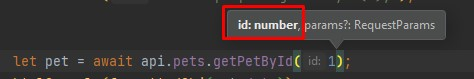
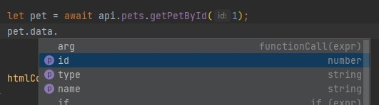
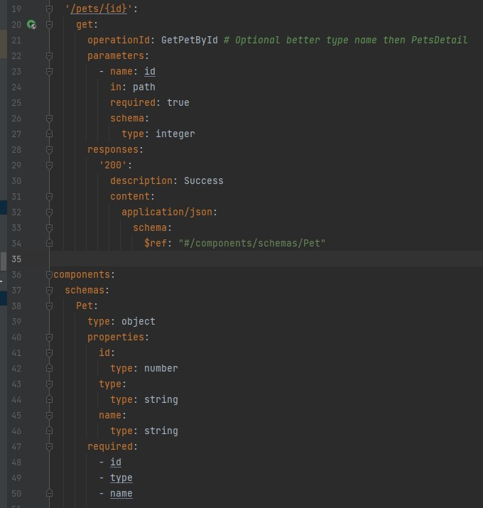

# Pets API

This is the auto published API SDK from the backend project here: [https://github.com/rehanvdm/pets-backend](https://github.com/rehanvdm/pets-backend).

Important note about versioning. The NPM package version is the same as the OpenAPI spec version. To prevent breaking
changes, the version number of the API has to be fixed when installing the package.

## Installing

1. Create a [Personal Access Token(PAT) on GitHub](https://docs.github.com/en/authentication/keeping-your-account-and-data-secure/creating-a-personal-access-token#creating-a-token)
   so that we can get the SDK API NPM package. You need to assign the flowing permissions:
    - `read:packages` Download packages from GitHub Package Registry
2. Make a copy of the `.npmrc.example` file and replace:
   -`<YOUR PERSONAL ACCESS TOKEN HERE>` with your GitHub Personal Access Token (PAT) that you obtained above
    - `<YOUR GITHUB PROFILE OR ORGANIZATION NAME>` with your GutHub username of where the package is installed
3. Now you can install packages `npm install @rehanvdm/pets-api@0.0.1`

## Using the API SDK package

Example:
```typescript
import {Api} from "@rehanvdm/pets-api"

const apiBaseUrl = "<YOUR URL HERE - NO TRAILING SLASH>";
const api = new Api({
   baseUrl: apiBaseUrl,
   // baseApiParams: {
   //   headers: {
   //     "Authorization": "<YOUR TOKEN HERE>"
   //   }
   // }
});

let pet = await api.pets.getPetById(1);
console.log(pet);
 ```

Note that you get autocomplete for the function (aka API arguments, with proper types) right in your IDE.





The raw OpenAPI spec file can be seen at `node_modules/@rehanvdm/pets-api/schema.yaml`. The `api.pets.getPetById`
method corresponds to the `GET /pets/{id}` API call.




